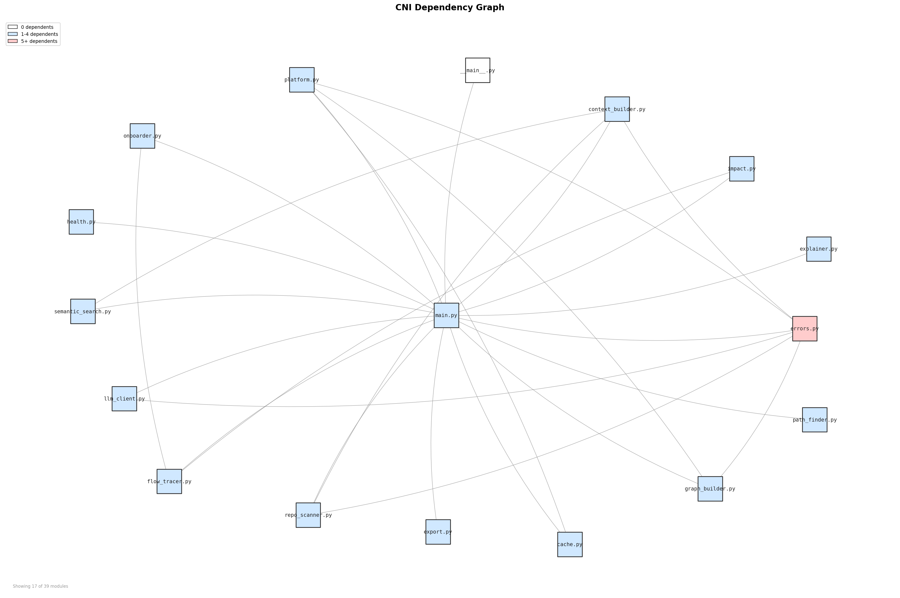

# CNI — Codebase Neural Interface

Talk to your entire codebase like it's a living system.

---

## Features

| Command        | Description                                                    |
| -------------- | -------------------------------------------------------------- |
| `cni analyze`  | Scan a repository, build a dependency graph, and print stats.  |
| `cni graph`    | Build and display the dependency graph for a repository.       |
| `cni path`     | Find the shortest dependency path between two files.           |
| `cni explain`  | Explain how a file participates in the dependency graph.       |
| `cni ask`      | Ask a natural-language question about the codebase (via LLM).  |

---

## Installation

```bash
# Clone the repo
git clone https://github.com/Slambot01/CNI_ATLAS.git
cd CNI_ATLAS

# Install in editable mode
pip install -e .
```

### Ollama (required for `cni ask`)

CNI uses [Ollama](https://ollama.com/) for local LLM inference.

```bash
# Install Ollama (see https://ollama.com/download)
# Start the server
ollama serve

# Pull the default model
ollama pull qwen2.5-coder:7b
```

---

## Configuration

### Cache

CNI caches scan results in `<repo_root>/.cni/cache.json`.
The cache stores scanned file paths, dependency edges, and file
modification timestamps.

**To clear the cache** simply delete the file:

```bash
rm -rf .cni/
```

The next `cni analyze` run will perform a full rescan.

---

## Usage

> **Note**: If you installed via `pip install -e .` and get an error that `cni` is not recognized (common on Windows), your Python Scripts directory is not on your system PATH. 
> You can simply use **`python -m cni`** instead of `cni` for all commands below.

### Analyze

```bash
$ cni analyze .
Analyzing repository...
Files scanned: 12
Dependency graph built.
Repository statistics
------------------------------
  Files indexed     : 12
  Dependencies      : 8
  Isolated files    : 3
  Most imported     : 4 dependents
```

### Graph

```bash
$ cni graph .
Building dependency graph...
Files scanned: 12
Dependency graph built.

Repository statistics
------------------------------
  Files indexed     : 12
  Dependencies      : 8
  Isolated files    : 3
  Most imported     : 4 dependents
```

### Path

```bash
$ cni path cni/cli/main.py cni/graph/graph_builder.py
Scanning repository...
Building dependency graph...
Searching dependency path...
main.py
  → graph_builder.py
```

### Explain

```bash
$ cni explain graph_builder.py
Scanning repository...
Building dependency graph...
Analyzing file...

File: graph_builder.py
Imports:
  repo_scanner.py
Imported by:
  main.py
```

### Ask

```bash
$ cni ask "What does repo_scanner do?"
Scanning repository...
Building dependency graph...
Retrieving relevant context...
Querying LLM...

repo_scanner.py recursively walks a directory tree and collects
all Python (.py), JavaScript (.js), and TypeScript (.ts) source files,
skipping common non-source directories like .git and node_modules.
```

---

## Example Output

Generate a demo dependency graph:

```bash
python docs/generate_demo.py
```



---

## Project Structure

```
cni/
├── __init__.py
├── cli/
│   ├── __init__.py
│   └── main.py              # Typer CLI entrypoint
├── analyzer/
│   ├── __init__.py
│   └── repo_scanner.py      # Repository file scanner
├── graph/
│   ├── __init__.py
│   ├── graph_builder.py       # Dependency graph builder
│   └── export.py             # Graphviz export with clustering
├── analysis/
│   ├── __init__.py
│   ├── path_finder.py        # Shortest dependency path
│   └── explainer.py          # File-level dependency explainer
├── retrieval/
│   ├── __init__.py
│   ├── semantic_search.py    # Sentence-transformer semantic search
│   └── context_builder.py    # LLM context builder
├── llm/
│   ├── __init__.py
│   └── llm_client.py         # Ollama LLM client
└── storage/
    ├── __init__.py
    └── cache.py              # JSON-based scan cache
docs/
└── generate_demo.py          # Demo graph generation script
pyproject.toml
README.md
```

---
